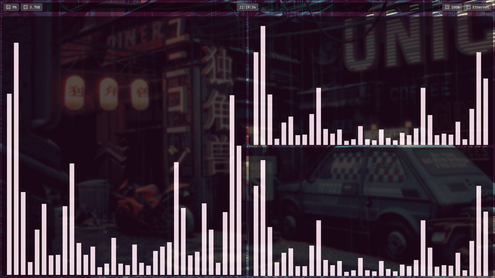
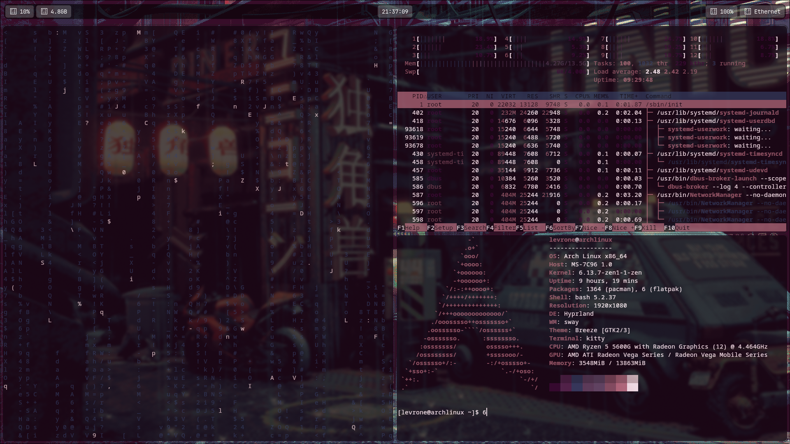

<h1 align="center">Hyprland Dotfiles Manual Installation 🚀</h1>

  
  
  

  <b>Welcome to my Hyprland dotfiles repository!</b> 
  This guide will walk you through manually installing and setting up your Hyprland configuration for a clean and aesthetic experience.

<h2>📌 Prerequisites</h2>

<table align="center">
  <tr>
    <th>Requirement</th>
    <th>Description</th>
  </tr>
  <tr>
    <td>Hyprland</td>
    <td>A working installation of <a href="https://github.com/hyprwm/Hyprland">Hyprland</a></td>
  </tr>
  <tr>
    <td>Git</td>
    <td>Required for cloning the repository</td>
  </tr>
  <tr>
    <td>Terminal Knowledge</td>
    <td>Basic understanding of using the terminal</td>
  </tr>
</table>

<h2>📥 Installation Steps</h2>

<h3>1️⃣ Clone the Repository</h3>
<pre><code class="language-bash">cd ~
git clone https://github.com/levrone24/Soulbound-Bloom.git </code></pre>

<h3>2️⃣ Backup Existing Configurations</h3>

Before overwriting your existing configuration, make a backup:

<pre><code class="language-bash">cp ~/.config/hypr/hyprland.conf ~/.config/hypr/hyprland.conf.bak
</pre>

<h3>3️⃣ Install the necessary tools like:</h3>
<pre>yay -S wlogout, yay -S hellwal
sudo pacman -S rofi waybar swaylock swww neofetch</pre>

<h3>4️⃣ Move The Configuration Files</h3>

Move the necessary files to the appropriate directories:

<pre><code class="language-bash">mv ~/Soulbound-Bloom/hypr ~/.config/hypr
mv ~/Soulbound-Bloom/kitty ~/.config/kitty
mv ~/Soulbound-Bloom/systemd ~/.config/systemd
mv ~/Soulbound-Bloom/waybar ~/.config/waybar
mv ~/Soulbound-Bloom/wlogout ~/.config/wlogout
mv ~/Soulbound-Bloom/wofi ~/.config/wofi
mv ~/Soulbound-Bloom/swaylock ~/.config/swaylock</code></pre>

<h3>5️⃣ Enable the scripts</h3>
<pre><code class="language-bash">cd ~/.config/hypr/scripts/ 
chmod +x *.sh
systemctl --user enable swww.service
systemctl --user start swww.service
systemctl --user status swww.service
systemctl --user enable --now polkit-agent.service
</code></pre> 
If you face issues, ensure that systemd for the user is active: Sometimes, the user instance of systemd might not be started. You can start it by logging out and logging back in or running the following command:
 
<pre>systemctl --user start
</pre>

<h3>6️⃣ Install Custom SDDM Theme</h3>
<pre><code class="language-bash">sudo mv ~/Soulbound-Bloom/custom-theme /usr/share/sddm/themes/
</code></pre>

Open /etc/sddm.conf through this command:

<pre>sudo nvim /etc/sddm.conf</pre>

This requires sudo as /etc/ is a system directory. Locate the [Theme] section: Look for a section that starts with [Theme]. If it doesn’t exist, you can add it manually.Set the theme name: Add or modify the line specifying the theme. It should look like this:

<pre>[Theme]
Current=custom-theme</pre>

<h3>7️⃣ Restart Hyprland</h3>

Once everything is in place, restart Hyprland to apply the new configuration:

<pre><code class="language-bash">hyprctl reload</code></pre>

If something isn't working correctly, you can log out and log back in or reboot the system:

<pre><code class="language-bash">reboot</code></pre>

<h2>🛠️ Troubleshooting</h2>
<ul>
  <li>If you encounter issues, restore your previous configuration:</li>
</ul>
<pre><code class="language-bash">cp ~/.config/hypr/hyprland.conf.bak ~/.config/hypr/hyprland.conf
</code></pre>
<ul>
  <li>Check Hyprland logs for errors:</li>
</ul>
<pre><code class="language-bash">journalctl -xe | grep hyprland</code></pre>

<h2>🎨 Screenshots & Previews</h2>

<h2>🤝 Contributing</h2>

If you have any suggestions or improvements, feel free to open a <b><a href="https://github.com/levrone24/Soulbound-Bloom/pulls">pull request</a></b> or submit an <b><a href="https://github.com/levrone24/Souldbound-Bloom/issues">issue</a></b> on GitHub!

<h2>🎉 Conclusion</h2>

Your Hyprland dotfiles should now be installed and configured! Enjoy your personalized desktop environment. 🚀

<b>⭐ Don't forget to <a href="https://github.com/levrone24/Soulbound-Bloom/stargazers">star the repo</a> if you like it! ⭐</b>

5
